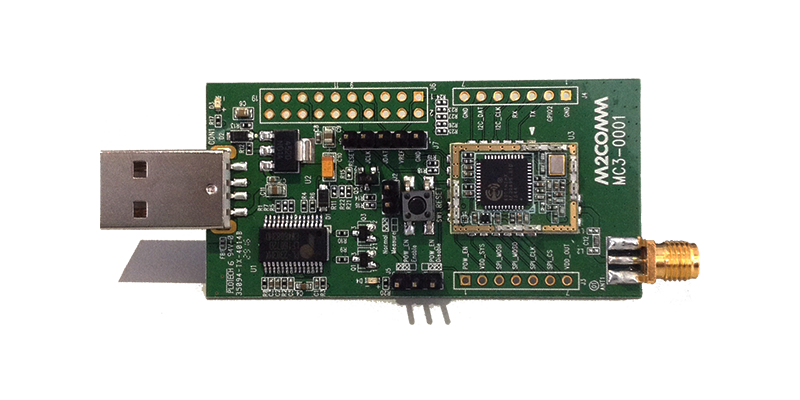
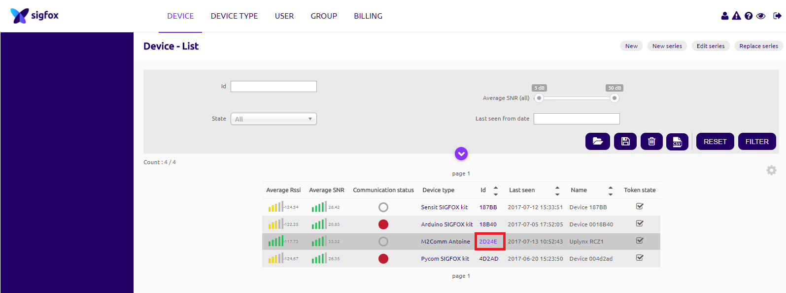
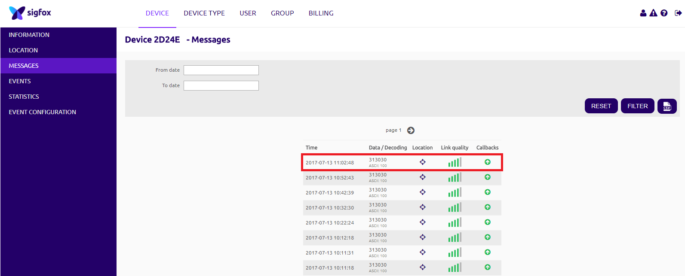
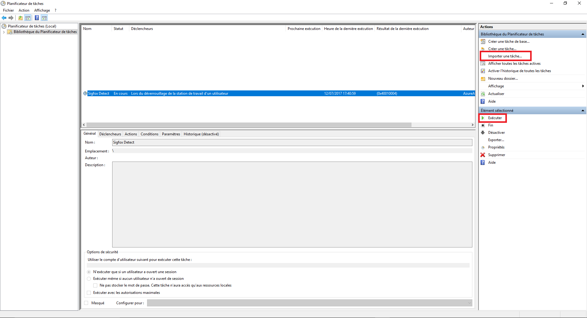
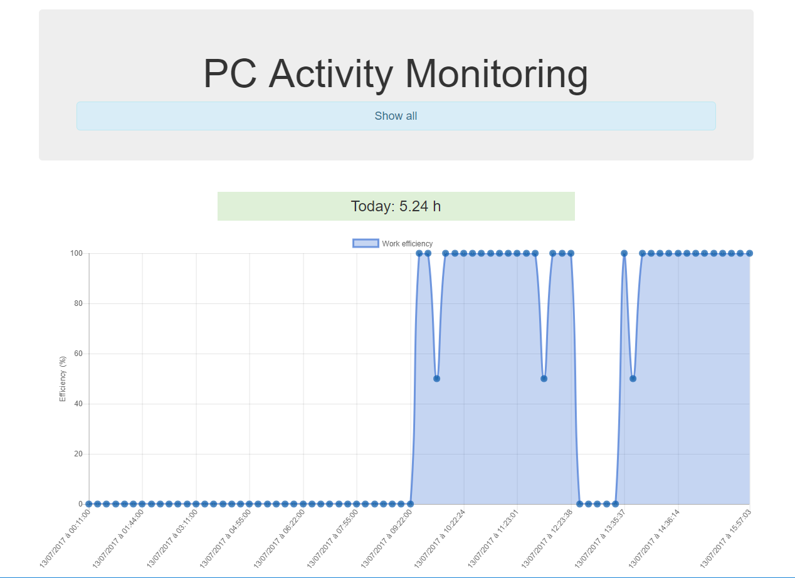

# Sigfox PC Activity Monitoring :mag: :bar_chart:

This tutorial will cover how to __distantly monitor PC activity__, from __anywhere__ without requiring it to be connected to the Internet. This kind of system could be used to __remotely _detect_, _track_ and _report___ special events triggered on a computer.

## Hardware
- [M2COMM Uplynx RCZ1 Evaluation Board](https://www.m2comm.co/portfolio-view/uplynx-rcz1/)

This board has a USB adapter which allows __serial communication__. We will use a simple Python script to communicate with __AT commands__.

<p align="center">
    
</p>

## Software
For this tutorial, the goal is to __check the idle time__ and send a message over Sigfox accordingly. This can be useful to __detect__ if someone is using your PC or calculate the __time spent__ on it _for example_. You may also play with the `pypiwin32` module if you wish to detect other kind of information (softwares being used, keylogging :smiling_imp:, ...).

### Prerequisites
- Python 2.7 _or over_
- A __Windows__ operating system

### Installation
- Python modules:
``` Bash
pip install pyserial
pip install pypiwin32
pip install binascii
```
- Set the correct __COM port__ in `main.py`
- __Activate__ your device on the __[Sigfox Backend](https://backend.sigfox.com/activate)__ (follow [this](https://backend.sigfox.com/activate/m2comm) link for the M2COMM provider). You will need the device ID and PAC. Use the functions `sigfox.getDeviceID()` and `sigfox.getDevicePAC()` in `main.py` to get them.

#### Run to test
``` Bash
python main.py
```

The boards LED should turn red when a message is being sent over Sigfox.
Make sure the messages are well received on the [Sigfox Backend](https://backend.sigfox.com/device/list). Log in, go to the __DEVICE__ section and click left on your device Id. You can than go the __MESSAGES__ section to see the payloads.

<p align="center">
    
</p>

<p align="center">
    
</p>

#### Windows Task Scheduler
The Python script can be launched as a background Windows task when a user session is opened for example. You can `import` __[this](https://github.com/AntoinedeChassey/sigfox_activity_monitoring/blob/master/task/task.xml)__ file on the Windows Task Scheduler (you can also find the file in the _task_ folder).

`pythonw.exe` is used to launch a Python script as a background process on Windows. Make sure you have it installed on your machine (mine is located here _C:\Python27\pythonw.exe_).

<p align="center">
    
</p>

Below are the defined conditions to report activity:

``` Python
# Check if there is activity (less than 10 minutes)
if(idleTime <= 60 * 10):
    # idleTime over 8 minutes
    if(idleTime >= 60 * 8):
        sigfox.sendPayload("25")
    # idleTime over 4 minutes
    elif(idleTime >= 60 * 4):
        sigfox.sendPayload("50")
    # idleTime less than 4 minutes
    else:
        sigfox.sendPayload("100")
# idleTime over 10 minutes
else:
    sigfox.sendPayload("0")
```
This snippet is looped every 10 minutes.

In order to send a message over Sigfox, we are establishing a serial communication with the board and sending the corresponding AT command (check it out in the `Sigfox()` class):

``` Python
def sendPayload(self, frame):
    bytesFrame = str.encode(frame)
    hexFrame = str(binascii.hexlify(bytesFrame)).encode('ASCII')

    cmd = "\rAT$SF=" + hexFrame + "\r\n"
    self.ser.write(cmd.encode())
    print("--------------------------------")
    print(self.ser.readline().rstrip('\r\n'))
    print(self.ser.readline().rstrip('\r\n'))
    print(self.ser.readline().rstrip('\r\n'))
```

The payload must be converted to hexadecimal and cannot be larger than 12 bytes.

___

### [Optional] Going further - web application
If you wish to retrieve and display the Sigfox messages on a personnal web application, you are free to use the one I developped (in folder `"webapp"`). It plots a graph in real time with the data sent from the Python script (values between 0 and 100) and saves the payloads in a database.

In order to make it work, you will also have to set a __CALLBACK__ on the Sigfox Backend pointing to your application URL and posting the devices data. You can have a look at [this](https://www.hackster.io/antoine-de-chassey/sigfox-texting-with-sipy-3316b4) tutorial to get some help on how to do that.

This web application is built with __Node.js__ and uses:
- MongoDB to store incoming messages
- EJS pages
- Websockets for live data visualization (Socket.io)
- _and many more npm packages_

#### Install and run
``` Bash
git clone https://github.com/AntoinedeChassey/sigfox_activity_monitoring
cd sigfox_activity_monitoring/webapp
mv .env.example .env
# Update the DB_URI variable in .env so it matches your own MongoDB configuration
nano .env
sudo npm install
sudo node server.js
```

<p align="center">
    
</p>

Have fun hacking this to build cool things! Also, feel free to post your Python scripts if you add some nice features. :sunglasses:


> *Antoine de Chassey*
